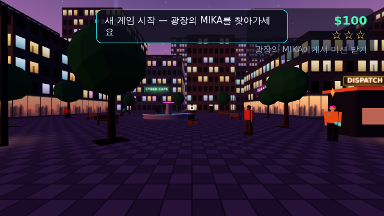
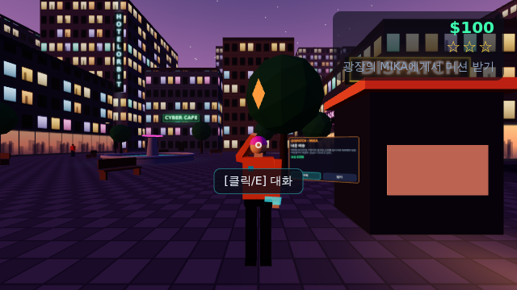
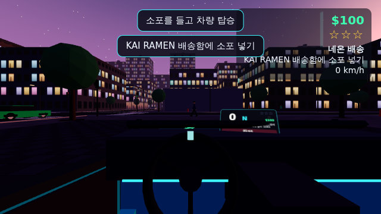
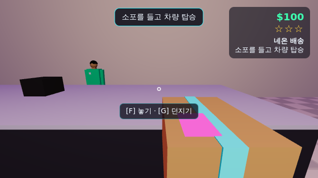
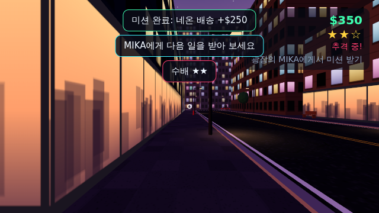
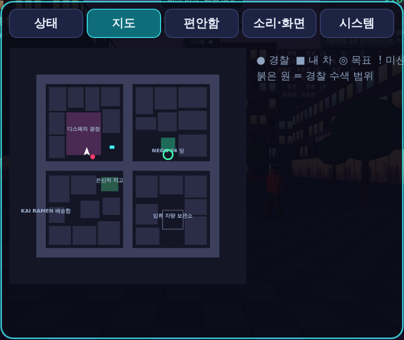

# NEON DISTRICT VR

해 질 녘 네온 거리를 걷고, 물건을 집고, 차를 몰고, 미션을 하고, 경찰을 따돌리는 **오리지널 WebXR 오픈월드 액션 수직 슬라이스**입니다.
GTA 계열 게임의 "자유도 → 행동 → 반응 → 보상" 흐름을 참고했지만, 지도·캐릭터·대사·로고·음악·에셋은 모두 이 프로젝트에서 새로 만든 것입니다(외부 이미지/사운드 파일 0개, 전부 코드로 생성).

| 광장 시작 지점 | MIKA 미션 보드 | 운전석(오픈톱) |
|---|---|---|
|  |  |  |
| **NEON 24 편의점(실내)** | **수배 2단계** | **손목 메뉴 – 지도** |
|  |  |  |

> 스크린샷은 헤드리스 Chromium(소프트웨어 렌더러)에서 자동 테스트 중 촬영한 것입니다.

---

## 바로 플레이하기

```bash
npm install
npm run dev          # http://localhost:5173  (같은 네트워크 기기는 --host 주소로 접속)
```

- **데스크톱(헤드셋 없음)**: 타이틀에서 `데스크톱으로 플레이` → 화면 클릭(마우스 고정).
- **PC VR (SteamVR/Quest Link + Chrome/Edge)**: `localhost`는 보안 컨텍스트라 바로 `VR로 시작` 가능.
- **Quest 브라우저(독립형)**: WebXR은 HTTPS 또는 localhost에서만 동작합니다.
  - USB 연결 후 `adb reverse tcp:5173 tcp:5173` → Quest 브라우저에서 `http://localhost:5173`
  - 또는 GitHub Pages 배포(아래 "배포") 주소로 접속
- **XR 에뮬레이터**: 타이틀의 `XR 에뮬레이터로 시작`은 Meta IWER(가상 헤드셋)를 설치해 WebXR 코드 경로를 그대로 실행합니다(자동 테스트용, 조작 UI 없음).

### 조작

| 동작 | VR (오른손잡이 기본, 메뉴에서 좌우 전환) | 데스크톱 |
|---|---|---|
| 이동 | 왼스틱 | WASD (Shift 달리기) |
| 회전 | 오른스틱 좌우 (스냅 45° 기본 / 부드러운 회전 선택) | 마우스 (Q/Z 스냅) |
| 텔레포트 | 오른스틱 앞으로 → 조준 → 놓기 | T 누르고 조준 → 떼기 |
| 잡기/놓기 | 그립 (가까우면 직접, 멀면 끌어오기) / 양손 지원 | F (조준한 물체), G 던지기 |
| 선택/사용 | 트리거 (버튼·문·UI·NPC, 들고 있는 블래스터 발사) | 클릭 / E |
| 상호작용·탑승·하차 | A | E |
| 손목 메뉴 | Y (손목을 얼굴 쪽으로 돌리면 미니 상태창) | Tab / M |
| 운전 | 오른트리거 가속, 왼트리거 브레이크·후진, 왼스틱 조향, 오른스틱 클릭 핸드브레이크, B 경적 | W/S, A/D, Space, H |
| 차량 복구 | X | R |
| 시트 재정렬 | 왼스틱 클릭 | C |
| 디버그 / 튜닝 | 손목 메뉴 → 시스템 → 디버그 표시 | F3 / F4 |

### 게임 흐름 (첫 번째 플레이어블 루프)

1. 디스패치 광장의 **MIKA**(주황 재킷, 머리 위 `!`)에게 A/E → 미션 보드에서 `수락`
2. **네온 배송**: NEON 24 편의점 → 문 열고 들어가 카운터의 소포를 그립으로 잡기 → 차 문 열고 탑승(소포는 조수석에 자동 보관) → KAI RAMEN 배송함에 소포 넣기 → **$250**
3. **네온 런**: 9개 체크포인트를 150초 안에 순서대로 통과 → **$400**
4. **핫 드라이브**: 압류 보관소의 데이터 칩 집기 → 경보와 함께 **수배 ★★** → 경찰의 시야·수색 범위를 벗어나 수배 해제 → 은신처 차고(GARAGE 13) 복귀 → **$800**
5. 은신처 터미널/손목 메뉴에서 저장(미션 완료·수배 해제 시 자동 저장) → 새로고침 후 `이어하기`로 복구

---

## 1. 현재 환경 및 가정

| 항목 | 결정 | 이유 |
|---|---|---|
| 플랫폼 | **몰입형 웹(WebXR)** — 원래 기획의 Unity/URP/OpenXR/XRI 대신 | 사용자 요청("몰입형웹으로 할거야"). 저장소가 비어 있어 기존 프로젝트와 충돌 없음 |
| 엔진 | three.js **0.186.1** (WebGL2 + WebXRManager) | 설치된 버전의 소스를 직접 확인해 `xr.updateCamera`, `setFoveation`, `getControllerGrip` 등 실제 API만 사용 |
| 물리 | cannon-es **0.20.0** (`RaycastVehicle`, 고정 60 Hz + 보간) | 순수 JS라 Node에서 단위 테스트 가능. **확인한 버그**: 회전된 `CANNON.Plane`에 대한 레이캐스트가 z>0에서 빗나감 → 지면을 얇은 Box로 대체 |
| 언어/빌드 | TypeScript 5.9.3 (strict), Vite 8.3.2 | |
| 테스트 | Vitest 5.0.3(단위), playwright-core 1.63 + 사전 설치된 Chromium 141(헤드리스 E2E), **IWER 2.5.0**(WebXR 에뮬레이션) | |
| 주 타깃 | 컨트롤러 기반 PC VR(Quest Link/SteamVR) + Quest 브라우저, 90 Hz 목표, 서서 플레이 | 손 추적(컨트롤러 없음)은 v1 범위 밖 |
| 외부 에셋 | **없음**. 텍스처(창문·아스팔트·네온 간판)는 Canvas로, 사운드는 WebAudio로 실시간 합성 | 라이선스·누락 파일 위험 0 |
| Unity 요구사항 대응 | 인스펙터 → `src/config/tuning.ts` + 데스크톱 **F4 실시간 튜닝 패널** / 씬 → `Game.ts` 구성 루트 / 레이어 → cannon `collisionFilterGroup/Mask` / Input System 액션 → `InputRouter.Actions` | |

## 2. 짧은 구현 계획 (단계 A→F, 모두 구현)

- **A. XR 기반**: 리그(`PlayerRig`), 입력 라우터(XR/데스크톱 공통 액션), 부드러운 이동·스냅/부드러운 회전·텔레포트, 비네트·페이드, 앉은 자세 키 보정
- **B. 상호작용**: 근거리/원거리 잡기, 던지기, 양손(조준형·중앙형), 소켓, 경첩 문, 누름 버튼(포크+레이), 월드 UI 패널, 손목 메뉴, 햅틱
- **C. 차량**: 레이캐스트 차량 + 아케이드 보조, 문→페이드→착석, 수평 고정 좌석, 계기판, 충돌 반응, 안전 하차, 전복/끼임 복구, 선택형 핸들 잡기
- **D. 도시·AI**: 300×300 m 구역, 9개 교차로·신호등, 보행자/교통/경찰 상태 머신, 수배 0~3, 목격 기반 범죄
- **E. 게임 루프**: 데이터 기반 미션 3개, 보상, 저장/불러오기(백업·손상 복구)
- **F. 완성도**: 절차적 그래픽·사운드, 디버그/성능 오버레이, 단위·E2E·XR 테스트, 배포 워크플로

## 3. 프로젝트 폴더 구조

```
index.html               타이틀 화면 + 데스크톱 HUD DOM
src/
  main.ts                부트스트랩, 타이틀 버튼, IWER 에뮬레이터, window.neon(QA API)
  game/Game.ts           구성 루트 + 프레임 순서 + 저장/불러오기/메뉴 액션
  config/                settings.ts(저장되는 설정+검증) tuning.ts(게임플레이 수치) layers.ts(충돌 그룹)
  core/                  EventBus, events(이벤트 타입), math, Pool
  input/                 ControllerState(xr-standard), DesktopInput, InputRouter(액션 매핑)
  player/                PlayerRig, Locomotion, Teleport, ComfortOverlay, XRHands, PlayerController
  interaction/           InteractionManager, InteractorHand, Interactable, Grabbable, Socket, Door, PushButton, PanelInteractable
  vehicles/              VehiclePhysics(cannon), PlayerVehicle, CarModel, Dashboard, SteeringWheelGrab
  traffic/               AICar(키네마틱), TrafficManager(차선/신호/추월), Movers(프레임 스냅샷)
  npc/                   PedModel, PedestrianManager, MissionGiver(MIKA)
  police/                WantedSystem(0~3, LKP, 쿨다운), CrimeSystem(목격자), PoliceManager(차량+도보)
  missions/              missions.json(데이터), types.ts, MissionSystem(로직), MissionWorld(월드 연결)
  ui/                    CanvasPanel, WristMenu, Minimap, Notifier, Markers, DesktopHud
  audio/AudioEngine.ts   절차적 WebAudio(엔진·사이렌·발소리·문·충돌·환경음·징글)
  save/SaveSystem.ts     버전·검증·백업 슬롯
  world/                 CityLayout(데이터) CityBuilder StreetProps Landmarks PropFactory RoadNetwork StaticWorld geom2d Environment NeonSign MeshBatch Textures
  weapons/PulseBlaster.ts 가상의 비살상 스턴 블래스터(게임용 무기 1종)
  debug/                 DebugOverlay(텍스트+경찰 시야선+수색 범위+F4 튜닝) PerfMonitor(CPU 구간, GPU 타이머 쿼리)
tests/unit/              vitest: missions, wanted, save, world/roads, vehicle, npc, interaction
tests/e2e/               smoke.mjs(데스크톱 전체 루프) xr.mjs(IWER WebXR) perf.mjs(CPU 측정)
.github/workflows/       ci.yml(타입체크+단위테스트+빌드) deploy-pages.yml(GitHub Pages)
docs/                    QA_CHECKLIST.md(헤드셋 수동 점검표), screenshots/
```

## 4. 이번 단계에서 생성·수정한 파일

저장소가 비어 있었으므로 위 구조의 **모든 파일이 신규**입니다(게임 코드 약 13.5k줄 TS, 테스트 약 1.5k줄). 커밋 단위로 보면:

1. 핵심 시스템(입력·리그·상호작용·도시·차량 물리·AI·미션·저장) + 단위 테스트
2. 게임 루프 연결(Game/PlayerController/UI/오디오/무기/디버그) + 데스크톱 E2E
3. 버그 수정: 던지기 각속도 NaN → 물리 충돌 전체 오류(실제 헤드셋에서도 발생할 문제), 프레임 예외 시 XR 루프 정지 방지, IWER XR 테스트
4. 버그 수정: 추월 차량의 조기 합류 + NPC/상호작용/체포 테스트
5. 문서·CI·배포·성능 측정(이 문서)

## 5. 실행 가능한 코드

전체 코드는 저장소에 있습니다(의사코드·TODO 없음). 핵심 진입점: `src/main.ts` → `new Game(container)` → `renderer.setAnimationLoop(frame)`.

## 6. "씬" 구성과 "인스펙터" 연결 (웹 버전 대응)

Unity 씬/프리팹 대신 `Game` 생성자가 씬 그래프를 조립합니다.

```
Scene
├─ PlayerRig(rig: 바닥 원점, yaw만) ─ TrackingSpace(y=키 보정) ─ Camera(머리) ─ ComfortOverlay(비네트/페이드)
│                                                   ├─ XR controller ray ×2, grip ×2 (+손 모델, 손목 메뉴)
├─ City(지면·도로·차선·인도·건물 병합 메시·네온) / StreetProps(인스턴싱) / Landmarks(편의점·주유소·차고·압류소·광장)
├─ PlayerVehicle(차체·문 경첩·핸들·계기판·조수석 소켓) / AICar ×11(교통 8 + 경찰 3)
├─ Pedestrians(22) / Police officers(2) / MIKA / 점원
└─ Markers(목표 빔·체크포인트), Notifier, DebugOverlay helpers
```

**프레임 순서**(`Game.frameBody`): 입력 → 머리 포즈 동기화 → 이동체 스냅샷 → 플레이어(이동 또는 차량 입력) → 물리(고정 60 Hz, 서브스텝 안에서 차량·교통·경찰 키네마틱 갱신) → 차량 시각/좌석 고정 → 손 상호작용 → AI → 수배·범죄·미션 → 월드 애니메이션 → UI/오디오 → 렌더.

**인스펙터 대응**
- `src/config/tuning.ts`: 이동·텔레포트·잡기·던지기, 차량(엔진/브레이크/조향/서스펜션/보조), 교통, 보행자, 경찰(시야 거리·FOV·수색 반경·쿨다운·체포 시간) 수치.
- 데스크톱에서 **F4** → 같은 값을 실시간으로 수정하는 튜닝 패널.
- 물체별 잡기 위치/회전 오프셋: `Grabbable`의 `attach: { mode, position, rotationDeg, alignToRay }` (예: `PulseBlaster.ts`).
- 레이아웃(건물·구역·스폰·체크포인트·아이템 위치): `src/world/CityLayout.ts` 데이터.
- 미션: `src/missions/missions.json`(코드 수정 없이 목표·조건·보상·다음 미션 편집).

## 7. 패키지·입력·레이어 설정

**패키지**: `three`, `cannon-es` (런타임) / `typescript`, `vite`, `vitest`, `@types/three`, `iwer`, `playwright-core` (개발). 정확한 버전은 `package.json`에 고정.

**입력 액션**(`src/input/InputRouter.ts`): `move, run, turn, snapTurn, teleportAim/Confirm, interact, menu, recover, horn, throttle, brake, steer, handbrake, recenter, look, debug, tuning`. XR 컨트롤러는 xr-standard 매핑(`buttons[0]` 트리거, `[1]` 그립, `[3]` 스틱 클릭, `[4]` A/X, `[5]` B/Y, `axes[2..3]` 스틱)을 읽고, 아날로그 트리거/그립에 히스테리시스(0.55 누름 / 0.35 해제)를 둬 떨림을 막습니다. 주 사용 손 설정으로 좌우 스틱/트리거 역할이 바뀝니다.

**충돌 그룹**(`src/config/layers.ts`) — 플레이어는 물리 바디가 아니므로 소품·들고 있는 물체가 플레이어를 밀 수 없습니다.

| 그룹 | 충돌 대상 |
|---|---|
| STATIC(건물·벽·가로등) | PROP, PLAYER_CAR, PROJECTILE |
| PROP(쓰레기통·콘·상자·캔·소포) | STATIC, PROP, PLAYER_CAR, AI_CAR, PROJECTILE |
| PLAYER_CAR | STATIC, PROP, AI_CAR |
| AI_CAR(키네마틱 교통/경찰) | PROP, PLAYER_CAR (건물은 AI가 직접 회피) |
| HELD / 소켓에 꽂힌 물체 | 없음(키네마틱, 떨림 0) |

게임플레이 질의(보행 충돌, 시야, 텔레포트, 경찰 LOS)는 물리 엔진이 아닌 `StaticWorld`(XZ 균일 격자 + AABB, DDA 레이 순회)로 처리해 매 프레임 씬 전체 검색을 하지 않습니다.

## 8. 실행 및 테스트 절차

```bash
npm install
npm run typecheck        # tsc --noEmit (strict)
npm test                 # 단위 테스트 53개
npm run build            # dist/ (상대 경로, 하위 경로 배포 가능)
npm run smoke            # 헤드리스 Chromium: 데스크톱 전체 루프 50개 체크 + 스크린샷(tests/e2e/out)
npm run smoke:xr         # 헤드리스 Chromium + IWER: WebXR 경로 19개 체크
npm run perf             # CPU 구간별 시간(소프트웨어 렌더러이므로 렌더 수치는 참고 불가)
npm run test:all         # 위 전부
```

E2E는 `/opt/pw-browsers/...` 의 Chromium을 기본으로 사용합니다. 다른 환경에서는 `CHROME_PATH=/path/to/chrome npm run smoke`.

**QA API**: 브라우저 콘솔의 `window.neon` (`state()`, `teleport()`, `gotoCar()`, `enterCar()`, `flipCar()`, `setWanted(n)`, `save()/load()/corruptSave()/clearSave()`, `lookAt()`, `grab(id)` 등). 헤드셋 수동 점검은 [`docs/QA_CHECKLIST.md`](docs/QA_CHECKLIST.md).

**배포**: 저장소 Settings → Pages → Source를 "GitHub Actions"로 설정 후 `main`에 병합하거나 Actions에서 `Deploy to GitHub Pages`를 수동 실행 → HTTPS 주소를 Quest 브라우저에서 열기.

## 9. 확인한 사항과 확인하지 못한 사항

**자동으로 확인함(이 저장소에서 실제 실행)**
- `tsc --noEmit` 오류 0, 프로덕션 빌드 성공(메인 번들 gzip 약 300 KB, IWER는 지연 로딩 청크).
- 단위 테스트 53개 통과: 미션 진행·중복 이벤트 무시·보상 1회·실패/재시작/체크포인트 재개, 수배(목격 주체별 단계, 수색 반경 안/밖 쿨다운, 재목격 리셋), 저장(없음·손상·백업 복구·필드별 복구·저장소 예외), 도로망(차선 연결·신호 상호 배타), 차량 물리(가속·최고속·브레이크→후진·조향 방향·전복 감지/복구·벽 끼임 감지), 교통(적신호 정지 후 녹색 출발, 막힌 차선에서 경적→추월, 충돌 없음), 보행자(완전히 막힌 길에서 되돌아감, 도망·넘어짐→일어남), 경찰(시야선 기반 목격, 추적→시야 상실 후 LKP 수색, 실제 위치를 알지 못함, 해제 시 철수), 양손 잡기(조준형·중앙형·핸드오버), 던지기 속도 유한성.
- 데스크톱 E2E 50개 통과: 이동·스냅 회전·텔레포트 → MIKA 대화/수락 → 편의점 도착 → 시선으로 문 열기 → F로 소포 잡기 → 차 문 열고 탑승(소포 조수석 보관) → 가속·조향·제동 → 하차 → 조수석에서 다시 잡기 → 배송함에 놓기 → 보상 $250 1회 → 수배 2 → 경찰 출동 → 시야/수색 범위 이탈로 해제 → 경찰 철수 → 경찰관 근접 시 체포·벌금·경찰서 앞 재배치 → 블래스터 발사의 목격 판정 → 미션 중간 재시작/포기 → 전복 감지·복구 → 벽 끼임 감지·도로 복구 → 저장→새로고침→복구(설정 포함) → 손상 파일→백업 복구 → 저장 없음→기본값. 페이지 오류 0.
- XR(IWER 에뮬레이션) 19개 통과: immersive-vr 세션, 손 방향별 컨트롤러 바인딩, 왼스틱 이동, 스냅 45°, 텔레포트, 그립 잡기·양손·핸드오버·놓기, Y 손목 메뉴, A로 탑승, 머리가 운전석 눈 위치에 정확히 배치, 트리거 가속, 앉은 자세 키 보정(1.1 m → 1.6 m), 세션 종료 후 데스크톱 복귀.

**확인하지 못함(하드웨어/환경 부족)**
- 실제 헤드셋에서의 **90 Hz 달성 여부, GPU 시간, 멀미/편안함, 손 모델 정렬, 햅틱 체감, 공간 음향**. 이 컨테이너에는 GPU와 헤드셋이 없어 렌더링은 SwiftShader(소프트웨어)로만 돌았습니다. FPS를 주장하지 않습니다.
- 측정한 것은 CPU 측 게임 로직뿐: 이 컨테이너 CPU에서 프레임당 업데이트 3.8~5.9 ms(헤드리스라 프레임이 느려 프레임당 물리 서브스텝이 최대 4회 → 60 Hz 물리 스텝 1회당 약 0.8~0.9 ms). 드로우콜 132(낮음)~358(운전, 중간 품질). 실제 기기에서는 F3/손목 메뉴 디버그 표시의 CPU 구간·드로우콜·GPU 타이머(브라우저가 `EXT_disjoint_timer_query_webgl2` 제공 시)로 측정하세요.
- Quest 독립형 성능: 별도 확장 단계(아래). PC VR과 같은 성능을 가정하지 않습니다.
- 손 추적(컨트롤러 없는 핸드 트래킹) 입력.

## 10. 알려진 제한 및 다음 구현 단계

- **성능**: 차량 1대당 약 10개 메시 → 교통/경찰 차량 메시 병합 또는 인스턴싱, 보행자 팔다리 스키닝 대신 인스턴싱, 물리 정지 바디 정리(가로등 실린더 → 박스) 및 원거리 소품 sleep 강화. Quest용으로는 `low` 품질(그림자 없음, 프레임버퍼 0.8) 기본 + 보행자 수·교통량 축소 프리셋.
- **조명**: 실시간 라이트는 해·반구광·실내 포인트 2개뿐이고 나머지는 이미시브/가짜 라이트 풀입니다. 진짜 라이트맵 베이크는 하지 않았습니다.
- **AI**: 도보 경찰과 보행자는 내비메시 없이 조향 + 벽 밀어내기만 사용(복잡한 실내 추적은 약함). 교통은 교차로 점유 검사로 충돌을 최소화하지만 완전한 예약 시스템은 아님.
- **차량**: 아케이드 보조가 강해 드리프트 표현은 제한적. 손상 모델 없음(충돌은 물리 반응·햅틱·소리·보행자 반응·경찰 범죄로만 처리).
- **입력**: 손 추적 미지원, 키 리매핑 UI 없음(코드 매핑 표만 존재).
- **콘텐츠**: 미션 3개, 실내 1곳(+차고). 다음 단계: 미션 추가(데이터만으로 가능), 라디오/음악, 차량 종류, 시간대 변화.

---

## 라이선스 / 출처

코드와 모든 생성 에셋은 이 저장소의 오리지널 작업입니다. 의존 라이브러리: three.js(MIT), cannon-es(MIT), IWER(MIT, 개발용).
